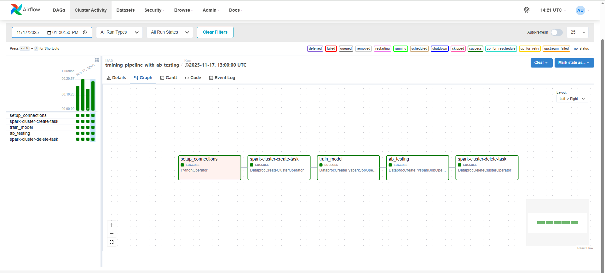
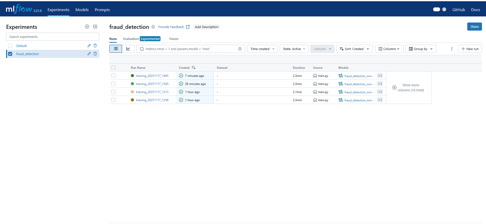
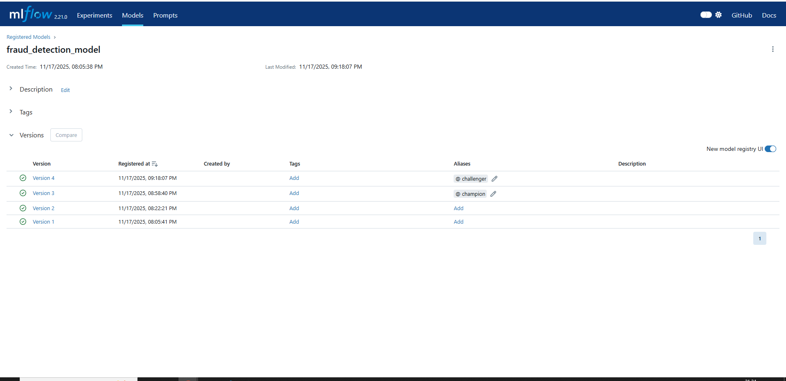

# Валидация модели обнаружения мошенничества

**Домашнее задание №7**  
**Курс MLOps**  
**Образовательная платформа «Otus»**

## Цель работы

В данном домашнем задании Вы потренируетесь в проведении валидации модели после ее обучения и анализ метрик. Вам предстоит видоизменить код модели для оценки метрик с использованием PySpark. Добавьте в MLFlow метрики оценки качества модели на А/В тесте.

## Описание проекта

>Итак, ваша модель обучена, более того периодически проводится переобучение и вы можете быть уверены, что для работы вы используете лучшую из имеющихся моделей. Или нет…

>Вас беспокоит вопрос, а тот эффект который вы наблюдаете на тестовой выборке он имеет статистическую значимость или это просто флуктуация метрик на случайной выборки. Так же вам не ясно какое распределение имеют метрики качества и вдруг в них вкрались не учтенные вами на стадии построения модели факторы, которые привели к систематической ошибки.

>Вам необходимо проверить эти гипотезы и автоматизировать проведение АВ теста качества переобученной модели.

>Из сказанного выше вытекает необходимость создания системы, способной проводить АВ тестирование переобученной модели. С помощью Apache Airflow вам нужно обеспечить периодический запуск АВ тестирования, а также контроль новых метрик с помощью MLFlow.

## Требования к инфраструктуре

### Облачная среда

Систему MLflow желательно запустить в облачной среде, обеспечив сохранение артефактов в облачном S3 хранилище.

## Задания

Решение будет ожидаться в виде репозитория/ветки на GitHub, с terraform конфигурациями и другим необходимым кодом для запуска всей системы.

### Обязательные задания

1. **Запустить систему Apache Airflow** в сервисе Yandex Cloud Managed Service for Apache Airflow.

2. **Запустить систему MLflow** на отдельной виртуальной машине, а также базу данных метаданных для MLflow в сервисе Yandex Cloud Managed Service for PostgreSQL/MySQL либо на отдельной ВМ.

3. **Выбрать стратегию для валидации модели** Создать код для проведения А/В теста и оценить метрики модели на выбранной стратегии.

https://github.com/CristianMachucaMendoza/hm7-ab-testing/blob/main/src/ab_test.py

4. **Добавить в AirFlow шаг** по валидации модели и фиксации метрик в MLFlow.
https://github.com/CristianMachucaMendoza/hm7-ab-testing/blob/main/dags/train_ab_test.py

5. **Обеспечить сохранение метрик модели и артефактов** (обученной модели) в S3 хранилище (Object storage).
https://github.com/CristianMachucaMendoza/hm7-ab-testing/blob/main/src/ab_test.py

6. **Разрешить периодическое исполнение разработанного DAG** в Apache AirFlow и протестировать его работоспособность.
